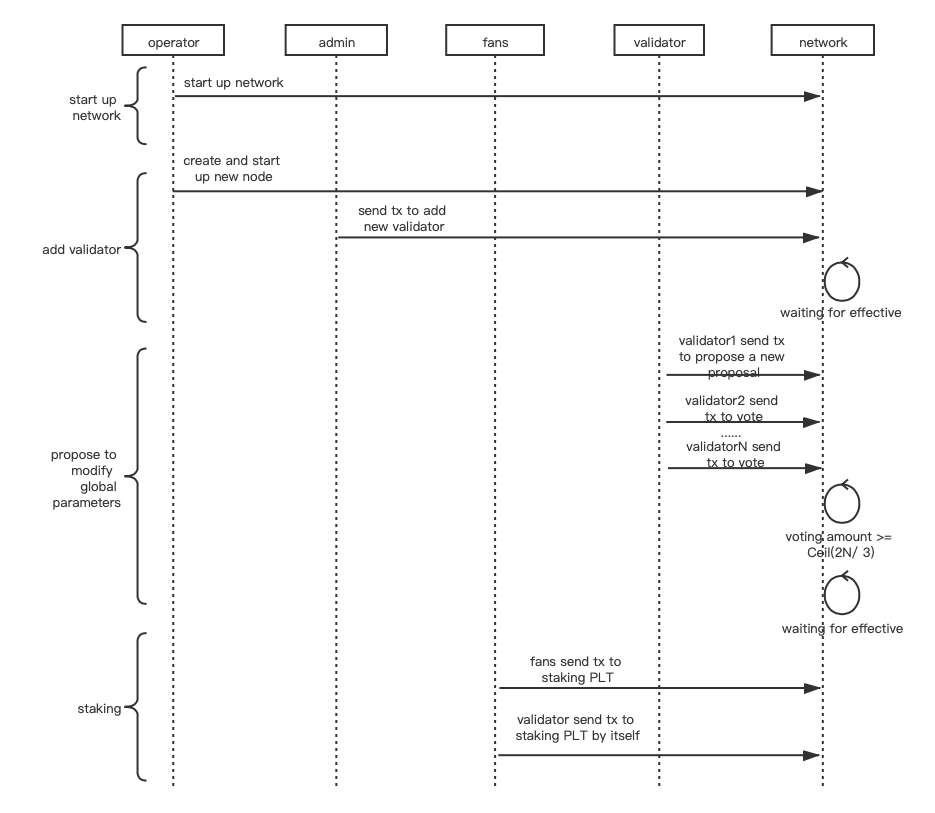

## Governance interfaces

#### Simple Summary
A standard interface for governance native contract of Palette chain, including 4 part as follow:

* Validators manage
* Proposal and voting
* Global parameters settle and gettle
* Reward

Palette governance contract has a effective period which used for caching paramters.<br>
and it's default value is a month. validators can proposer a proposal to modify global<br>
parameters and it will effective after a month if this proposal passed.

#### Flow chart


#### Methods

###### name
Return the name of contract, e.g: "Palette governance"
```dtd
function name() public view returns (string)
```

###### addValidator
Return the result of adding action.

NOTE: the param `revoke` is false denote delete the validator.

```dtd
function addValidator(validator address, revoke bool) public returns (bool success)
```

###### getEffectiveValidators
Return the effective validator's address list.

```dtd
function getEffectiveValidators() public returns (list address[])
```

###### getAllValidators
Return all validator's address list, including pending validators which has not yet effective.

```dtd
function getAllValidators() public returns (list address[])
```

###### stake
Return the staking result. fans can delegate some validator to staking PLT token. <br>
if validator address is the same with the tx sender, it means that validator staking by itself. <br>
if `revoke` = true, the staking amount will transfer back to tx sender. 

```dtd
function stake(validator address, amount uint256, revoke bool)
```

###### getStakeAmount
Return fans delegate amount. if the validator address is the same with owner address, <br>
return the validator staking amount. 

```dtd
function getStakeAmount(owner address, validator address) public return (amount uint256)
```

###### getValidatorTotalStakeAmount
Return the staking amount delegated by fans and validator itself.

```dtd
function getValidatorTotalStakeAmount(validator address) public return (amount uint256) 
```

###### getAllStakeAmount
Return total staking amount in governance contract.

```dtd
function getAllStakeAmount() public return (amount uint256)
```

###### propose
Return the proposal identity for this proposal.

OPTIONAL - proposal type include:
```dtd
const (
    ProposalTypeMinStakeAmount  = 1 // mininum staking amount, default value is 0
    ProposalTypeMintPrice       = 2 // NFT token mint price, default value is 0    
    ProposalTypeGasFee          = 3 // NFT token deploy gas fee, default value is 0
    ProposalTypeRewardFactor    = 4 // reward base factor, default value is 2000, this value in range
                                    // of (0, 10000), cann't be 0.  and it will convert to float number which
                                    // accurate to 2 decimals bits in contract, e.g: 34.02% -> big.NewInt(3402)
    ProposalTypeRewardPeriod    = 5 // reward period, default value is one month.
)
```

NOTE: Proposal expiration time is 2 weeks by default

```dtd
function propose(proposalType uint8, value uint256) public return (proposalId address)
```

###### getProposal
Return the detail info of some proposal

```dtd
function getProposal(proposalId address) return public (proposer address, proposalType uint8, value uint256, endBlock uint256)
```

###### vote
Return the voting result.

```dtd
function vote(proposalId address, revoke bool) public return (succeed bool)
```

###### getVoteTotalAmount
Return the vote amount with some proposal id.

```dtd
function getVoteTotalAmount(proposalId address) public return (value uint256)
```

###### getGlobalParams
Return the global parameters.

```dtd
function getGlobalParams(proposalType uint8) public return (proposalType uint8, value uint256)
```

###### setDelegateRewardFactor
Set delegate reward factor for validator itself, this factor used to calculate rewarding amount.<br>
and return the execution result.

```dtd
function setDelegateRewardFactor(factor uint256) public return (succeed bool).
```

###### getDelegateRewardFactor
Return validator's delegate reward factor.

```dtd
function getDelegateRewardFactor(validator address) public return (value uint256)
```

#### Events

###### addValidator
MUST trigger when validator added success.

```dtd
event addValidator(address validator, bool revoke)
```

###### stake
MUST trigger when staking succeed.

```dtd
event stake(address indexed owner, address indexed validator, bool revoke, value uint256)
```

###### propose
MUST trigger when proposed success.

```dtd
event propose(address indexed proposer, address indexed proposalId, uint8 proposalType, uint256 endBlock, value uint256)
```

###### vote
MUST trigger when validator voted success.

```dtd
event vote(address indexed owner, address indexed proposalId, uint256 amount, bool revoke)
```

###### delegateRewardFactor
MUST trigger when validator set reward factor succeed.

```dtd
event delegateRewardFactor(address validator, uint256 factor)
```
